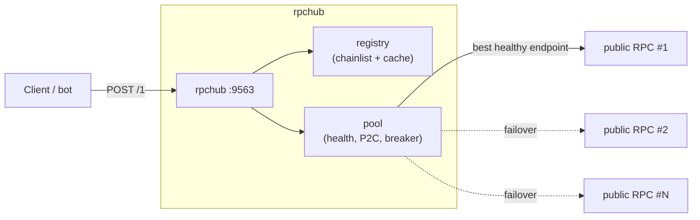

# rpchub

> Unified RPC proxy backed by chainlist: set chain IDs in env, get one stable JSON-RPC endpoint per chain.

<p>
  
  
  
  
</p>

```
POST http://localhost:9563/1          # Ethereum, by chain id
POST http://localhost:9563/ethereum   # same chain, by slug
POST http://localhost:9563/56         # BNB Smart Chain
POST http://localhost:9563/bnb        # short names work too
POST http://localhost:9563/solana     # exception: served from a static list
POST http://localhost:9563/1/archive  # archive-verified upstreams only
POST http://localhost:9563/1/indexer  # Ponder-compatible, sticky EVM source
ws://localhost:9563/1                 # subscriptions (eth_subscribe, logs, …)
ws://localhost:9563/solana            # slotSubscribe, accountSubscribe, …
```

### Highlights

- 🔗 **One endpoint per chain** — write `CHAIN_IDS=1,56` and let chainlist supply the rest.
- 🧭 **Smart routing** — health probes, latency-aware P2C selection, automatic failover, circuit breaker.
- 🕰️ **Stale-data guard** — nodes lagging behind the pool median are pulled out of rotation.
- 🔌 **WebSocket too** — the same URL upgrades, so subscriptions work without a second config.
- 🗄️ **Archive pool** — `/{chain}/archive` only ever routes to verified archive nodes.
- ◎ **Solana exception** — chainlist is EVM-only, so `/solana` runs off a built-in list.
- 📦 **Single static binary**, no dependencies, ready for Docker/Dokploy.



## Why

Public RPCs from chainlist are individually unreliable — some are dead, some rate-limited, some lagging behind the chain. rpchub puts all of them behind a single endpoint per chain:

- **Source:** `https://chainlist.org/rpcs.json` is fetched at boot, refreshed every `REFRESH_INTERVAL`, and cached on disk so the service still starts when chainlist is unreachable. URLs are aggressively sanitized: `${API_KEY}` placeholders, garbage records and invisible characters are all dropped, and each surviving entry is sorted into the HTTP or the WebSocket pool by scheme.
- **Health:** every endpoint is probed periodically (EVM: `eth_blockNumber`, Solana: `getSlot`). Chain identity is verified on first contact (`eth_chainId` / `getGenesisHash`) — an endpoint answering for a different chain is excluded permanently. Endpoints more than `MAX_BLOCK_LAG` behind the pool median are pulled out of rotation (stale-data guard).
- **Selection & failover:** power-of-two-choices among healthy endpoints (two random candidates, the lower-latency one wins). Timeouts, connection errors, 429/5xx and non-JSON bodies fail over to the next endpoint (`MAX_RETRIES` attempts within one `REQUEST_TIMEOUT` budget). Known provider restrictions, quota errors and transient JSON-RPC failures trigger failover for allowlisted read methods. Contract reverts, invalid parameters and unknown client methods retain their RPC errors. Chain identity must be verified before serving traffic. An endpoint that keeps failing enters an exponential cooldown.
- **Solana exception:** chainlist is EVM-only, so `/solana` is served from a built-in public list plus `SOLANA_RPCS` (mainnet-beta only; the genesis hash is verified).
- **WebSocket:** chainlist's `wss://` entries form a second pool per chain, probed and scored exactly like the HTTP one. Connecting a WebSocket client to `ws://host/{chain}` (or `/{chain}/ws`) picks a healthy upstream and relays the connection, so `eth_subscribe`, `logsSubscribe` and Solana's `slotSubscribe` work through the same URL as ordinary requests.
- **Archive detection:** every healthy EVM endpoint is periodically asked for `eth_getBalance(0x0, block 0x1)` — a pruned node fails with a state error, an archive node answers. The verdict is refreshed hourly, because public endpoints often sit behind load balancers mixing archive and pruned nodes. `POST /{chain}/archive` routes **only** to endpoints positively verified as archive-capable; undetermined ones never receive archive traffic.

## Quick start

```sh
CHAIN_IDS=1,56 SOLANA_ENABLED=true go run ./cmd/rpchub

curl -X POST localhost:9563/1 \
  -d '{"jsonrpc":"2.0","id":1,"method":"eth_blockNumber","params":[]}'

curl -X POST localhost:9563/solana \
  -d '{"jsonrpc":"2.0","id":1,"method":"getSlot"}'

# subscriptions over the same URL
wscat -c ws://localhost:9563/1 \
  -x '{"jsonrpc":"2.0","id":1,"method":"eth_subscribe","params":["newHeads"]}'
```

## Configuration

See [.env.example](.env.example) for every knob. The ones that matter most:

| Env | Default | What it does |
|---|---|---|
| `CHAIN_IDS` | — | Enabled EVM chains (e.g. `1,56,137`). The only required setting. |
| `SOLANA_ENABLED` / `SOLANA_RPCS` | `false` | Enables the `/solana` path; setting `SOLANA_RPCS` turns it on automatically. |
| `EXTRA_RPCS_<id>` / `EXTRA_RPCS_SOLANA` | — | Your own nodes; they go to the front of the list at the highest priority. |
| `ALIASES` | — | Extra path tokens: `bsc:56` → `POST /bsc`. |
| `MAX_BLOCK_LAG` | `10` | Endpoints this many blocks behind the median are benched (×20 slots on Solana). |
| `FILTER_TRACKING` | `false` | `true`: only use RPCs marked `tracking: none` in chainlist. |
| `WS_ENABLED` / `MAX_WS_CONNS` | `true` / `256` | WebSocket relaying and the cap on concurrent relayed connections. |

## Endpoints

| Endpoint | Description |
|---|---|
| `POST /{chain}` | JSON-RPC proxy. `{chain}` = chain id, slug, short name or alias. Batch requests supported. |
| `POST /{chain}/archive` | The same proxy, but restricted to endpoints verified as archive-capable. For deep `eth_getLogs`, historical `eth_call` / `eth_getBalance` and similar. Returns 503 until an archive endpoint has been discovered; not available for Solana (404). |
| `POST /{chain}/indexer` | EVM read-only route for Ponder. Requires fresh capability probes, keeps a preferred provider and validates head continuity before failover. Unsupported chains return 404. |
| `GET /{chain}/indexer/health` | Eligible provider count, preferred host, accepted head and consistency waiting reason. This is RPC health, not proof that an indexer is caught up. |
| `GET /{chain}` *(with `Upgrade: websocket`)* | Relays the connection to a healthy `wss://` upstream for subscriptions. A plain GET returns a usage hint instead. |
| `GET /{chain}/ws` | Same relay on an explicit path, for clients that prefer one. |
| `GET /chains` | Enabled chains, their tokens, healthy/archive/ws/total endpoint counts and the reference height. |
| `GET /health` | 200 when every chain has ≥1 healthy endpoint; `warming` during boot warm-up; 503 otherwise. |
| `GET /{chain}/health` | Per-endpoint status/latency/height (URL paths are redacted so API keys cannot leak). |

## Ponder indexing

Configure Ponder with this route, rather than the general load-balanced endpoint:

```ts
chains: {
  ethereum: { id: 1, rpc: `${process.env.RPCHUB_URL}/1/indexer` },
  bnb: { id: 56, rpc: `${process.env.RPCHUB_URL}/56/indexer` },
}
```

The HTTP prober verifies full transaction blocks, `eth_getLogs` with a block hash and a numeric range, and block lookup by hash. Capability verdicts expire after 10 minutes. Method restrictions and 30-second quota cooldowns survive successful basic health probes. The probe checks a one-block range; it does not certify arbitrary historical ranges or archive state.

The indexer route sticks to a preferred provider. A backup must share the accepted head or demonstrate a fork with a second hostname and an observed common ancestor within 64 blocks. A stale backup is refused instead of returning an older `latest`. If there is no verified source, reads return retryable HTTP 502/503. This is a consistency guard, not blockchain consensus: different hosts may share an underlying provider. Consistency history is held in memory and resets when RPCHub restarts.

Real reorgs and Ponder crash recovery can replay unfinalized blocks. Preserve Ponder's durable database/checkpoints; use Postgres for a production indexer. Monitor the indexer's actual block lag and time since progress separately from RPCHub `/health` and Ponder `/ready`. Free RPC availability and quotas cannot provide an uninterrupted-service guarantee.

Batch responses retain successful entries and retry only failed, allowlisted reads with IDs. Writes and notifications are never automatically replayed; a write interrupted during transport has an uncertain outcome, returned as an RPC error. Mixed batches use HTTP 200 with per-item errors to avoid encouraging clients to resend completed writes. All-read batches with unresolved entries use HTTP 502/503; clients should retry only the failed entries.

## Deployment (Docker / Dokploy)

```sh
docker compose up -d --build
```

On Dokploy: add the repo as a Dockerfile application, set the env vars in the panel, and point the healthcheck at `/health`. A volume is defined for `CACHE_DIR` (`/data`), so restarts come up from cache even when chainlist is unreachable.

## Known limits (v1)

- **WebSocket failover only happens while connecting.** Subscription ids belong to the node that issued them, so rpchub never switches upstream mid-session — that would silently drop your subscriptions. If the upstream dies, your connection closes and your client should reconnect (it will land on a healthy endpoint).
- No client auth, client rate-limiting or response caching.
- The `/archive` pool is bounded by the archive endpoints that can actually be detected: some chains have very few public archive RPCs, in which case the route honestly returns 503. Non-standard methods such as `trace_*` and `debug_*` may be disabled even on an archive node, and that upstream error passes through unchanged.

## License

[Apache-2.0](LICENSE) © luen-eth

RPC endpoints are derived from [chainlist.org](https://chainlist.org) data; rpchub only reads and health-checks that list.
